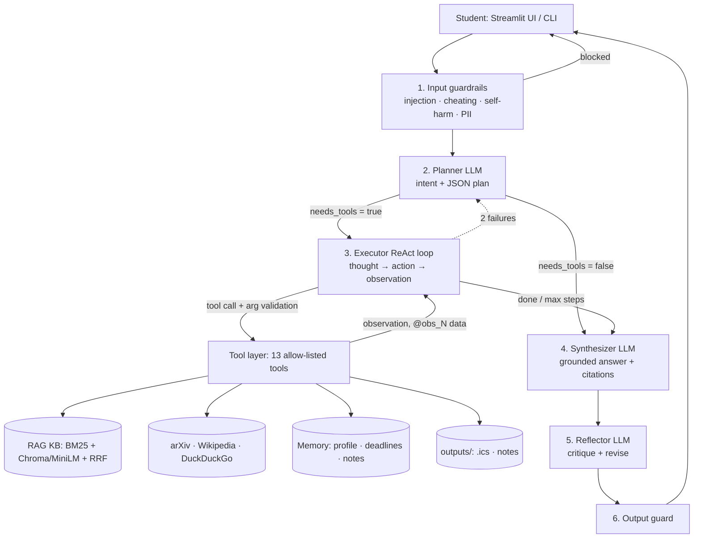

# Architecture (Mermaid – renders on GitHub)

```mermaid
flowchart TD
    U[Student: Streamlit UI / CLI] --> G1[1. Input guardrails<br/>injection · cheating · self-harm · PII]
    G1 -->|blocked| U
    G1 --> P[2. Planner LLM<br/>intent + JSON plan]
    P -->|needs_tools = false| S
    P -->|needs_tools = true| E[3. Executor ReAct loop<br/>thought → action → observation]
    E -->|tool call + arg validation| T[Tool layer: 13 allow-listed tools]
    T -->|observation, @obs_N data| E
    T --> RAG[(RAG KB: BM25 + Chroma/MiniLM + RRF)]
    T --> API[(arXiv · Wikipedia · DuckDuckGo)]
    T --> MEM[(Memory: profile · deadlines · notes)]
    T --> OUT[(outputs/: .ics · notes)]
    E -->|done / max steps| S[4. Synthesizer LLM<br/>grounded answer + citations]
    S --> R[5. Reflector LLM<br/>critique + revise]
    R --> G2[6. Output guard]
    G2 --> U
    E -. 2 failures .-> P
```
